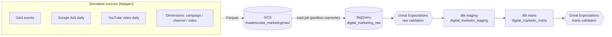

# PRD: Digital Marketing Data Pipeline (Portfolio Project)

This project will live in the `thaalescosta/digital-marketing-pipeline` repository.

| | |
|--- | ---|
| **Status** | Ready for implementation |
| **Last updated** | 2026-09-24 |
| **Project type** | Portfolio project: incremental ELT pipeline on GCP |
| **Stack** | Astronomer (Airflow) + Cosmos, dbt (BigQuery), Great Expectations, GCS, BigQuery |
| **Scope of this PRD** | Pipeline only, from data generation up to analysis-ready marts. **No dashboards.** |

---

## 0. Instructions for the implementing agent

Read this whole document before writing code.

1. **Legacy code.** An abandoned project's fake dataset generation code (`fake-data-gen`) is the starting point. Use it to create a new code that generates a database. Since this is a portfolio project we're using fake data.
2. **Work milestone by milestone** (Section 13). Each milestone has acceptance criteria. Don't start the next milestone until they pass. Make one commit per milestone.
3. **Don't guess versions.** Check current documentation for Astro Runtime, `astronomer-cosmos`, `dbt-core` / `dbt-bigquery`, and Great Expectations Core, then pin a mutually compatible set of versions and record it in the README. Names of APIs in this PRD (e.g. Cosmos `DbtTaskGroup`) are hints. Verify them against current docs.
4. **Secrets never go in git.** No service-account keys, no `.env`. Provide `.env.example` only.
5. **Where this PRD is silent**, choose the simplest option that satisfies the requirements and log the decision in `docs/decisions.md` (short entries: context, decision, why).
6. **If reality contradicts this PRD** (e.g. BigQuery rejects a load config), stop, document the finding, and propose the smallest change. Don't silently work around it.
7. **Priority tags:** **P0** = required, **P1** = should have, **P2** = stretch (only after all P0/P1 are done).

---

## 1. Overview

### 1.1 Purpose
This is a study/portfolio project: it demonstrates the architecture of a real-world digital marketing data pipeline. Real sources would be **Google Analytics 4** and **YouTube Analytics** (and maybe other various sources). This project demonstrates the same architecture using a **deterministic fake dataset** limited to **digital marketing data**.

### 1.2 Goals
- **G1.** Simulate a production-like incremental pipeline: an initial 6-month history load, then **one new day of data per Airflow run**.
- **G2.** Land raw files in GCS, load them into BigQuery raw tables, transform with dbt into **staging** and **marts** layers, orchestrated by Airflow using Astronomer Cosmos.
- **G3.** Enforce data quality with Great Expectations (source contracts and published data) plus dbt tests (model integrity).
- **G4.** Be **idempotent, reproducible and re-runnable**: re-running any day never creates duplicates.
- **G5.** Be documented well enough to be explained in a job interview (README, architecture diagram, decision log, data dictionary).

### 1.3 Non-goals
- Dashboards / BI (a later phase; marts must simply be ready to be used).
- Real GA4 / YouTube API connectors, streaming, CDC, ML, Terraform/IaC, cloud deployment (local `astro dev` is enough).
- PII handling beyond not generating any.

---

## 2. Fixed identifiers and configuration

| Item | Value |
|---|---|
| GCP project ID | `digital-marketing-509604` |
| GCS bucket | `thaalescosta_marketing` |
| BigQuery base dataset name | `digital_marketin` (**as given by the owner. Likely a typo for `digital_marketing`. See Section 15, Q1. Keep it configurable**) |
| Simulation start date | `2026-01-01` |
| Initial history | 6 months, so `2026-01-01` … `2026-06-30` inclusive (181 days) |
| First incremental day | `2026-07-01`. One additional day per DAG run thereafter |
| Timezone | UTC everywhere |
| Seed | `GEN_SEED=42` |

**BigQuery has no "schema" level below datasets**, so the layers are separate datasets sharing the base name (default; see Section 15, Q2):

| Layer | Dataset | Managed by |
|---|---|---|
| raw | `digital_marketing_raw` | Python loader |
| staging | `digital_marketin_staging` | dbt |
| marts | `digital_marketin_marts` | dbt |

In dbt, set the profile `dataset: digital_marketin` and use `+schema: staging` / `+schema: marts`. The default dbt `generate_schema_name` behaviour then yields exactly the names above. Don't override that macro.

### Environment variables (`.env.example` must contain all of these, no values for secrets)

| Variable | Default | Notes |
|---|---|---|
| `GCP_PROJECT_ID` | `digital-marketing-509604` | |
| `GCP_LOCATION` | `US` | Bucket and all datasets **must be in the same location** |
| `GCS_BUCKET` | `thaalescosta_marketing` | |
| `BQ_RAW_DATASET` / `BQ_STAGING_DATASET` / `BQ_MARTS_DATASET` | `digital_marketing_raw` / `_staging` / `_marts` | |
| `SIM_START_DATE` | `2026-01-01` | Replaces the legacy "months ago from today" default |
| `HISTORY_MONTHS` | `6` | Legacy default was 5 |
| `GEN_SEED` | `42` | |
| `DAILY_SESSION_VOLUME` | `550` | Legacy name `DAILY_EVENT_VOLUME` is misleading: it is **sessions per day** (~3.5 events each) |
| `GOOGLE_CLOUD_DEFAULT` conn / `GOOGLE_APPLICATION_CREDENTIALS` | `pipeline/include/gcp_creds/service_account.json` | Service-account auth, provided via Airflow connection; key file mounted, never committed |

**Service account (least privilege):** The `BigQuery Data Editor`, `BigQuery Data Viewer` and `Storage Admin` roles are already set for the project.

---

## 3. Legacy code: what exists and what must change

### 3.1 What exists (`legacy/fake-data-gen/src/datagen/`)

| Module | Purpose | Reuse? |
|---|---|---|
| `config.py` | env-driven config, channel map, event names | Yes, with changes |
| `schemas.py` | dataclasses for the 6 raw table contracts | Yes |
| `dimensions.py` | generates campaigns (8–14), channels (7, fixed), videos (10–18) | Rework (D1) |
| `distributions.py` | weekday seasonality, campaign lifecycle, ad metrics, YouTube decay | Yes |
| `generate_campaigns.py` | daily ad rows per campaign → ad group → ad | Yes, with fixes (D7, D8) |
| `generate_events.py` | GA4-style events: `session_start` + 1–4 follow-on events; 2% sessions have a `purchase` | Yes |
| `generate_youtube.py` | daily metrics per published video | Yes |
| `backfill.py`, `daily_update.py` | CLIs writing `dt=YYYY-MM-DD/part.parquet` | Rework (D2, D3, D5, D6) |
| `upload_gcs.py` | GCS upload and BigQuery load, `RAW_SCHEMAS` | Rework (D4, D9) |
| `tests/` | determinism, distribution, upload tests | Keep and update |

`faker` is listed as a dependency but never imported. Remove it. Ignore `.pytest_cache`, `__pycache__`, `*.egg-info` (add to `.gitignore`).

### 3.2 Verified defects and gaps

These were verified by running the legacy generator (seed 42, `2026-01-01` + 6 months, pandas 3.0.2).

| # | Pri | Finding | Required action |
|---|---|---|---|
| **D1** | **P0** | **Ads data stops when the initial campaigns end.** Dimensions are generated once for the backfill window. With seed 42 all 14 campaigns had ended by `2026-06-14`, so ads have **no rows for the last 16 days of the window**. `daily_update` for `2026-07-01` produced **0 ads rows** (and would for every later day). | Dimensions must **evolve over time** (Section 6.1.2). Invariant: at least 2 campaigns are active on every date ≥ `2026-01-01`. |
| **D2** | **P0** | **`backfill` crashes on current pandas.** In `_coerce_timestamps_to_us`, `is_datetime64_any_dtype` is also true for tz-aware columns, so `inserted_at` hits `.astype("datetime64[us]")` and raises `TypeError` (the `elif` branch is unreachable). | One shared Parquet writer that correctly handles tz-aware and naive datetimes. |
| **D3** | **P0** | `daily_update._write_rows` has **no timestamp coercion**, so daily and backfill files differ (`inserted_at` is `timestamp[us, tz=UTC]` in daily vs naive `timestamp[us]` in backfill). | Same shared writer for both paths. All timestamps are written as UTC, microsecond precision (BigQuery rejects nanosecond Parquet timestamps on some pandas versions). |
| **D4** | **P0** | **Loads are not idempotent.** `load_daily_to_bigquery` uses `WRITE_APPEND` (also for dims), so re-running a day duplicates rows. | Partition-scoped overwrite (Section 6.3). |
| **D5** | **P0** | `INSERTED_AT` is computed **at import time** and defaults use `date.today()`. Inside Airflow, module import time ≠ run time, and results would depend on the wall clock. | No wall-clock defaults in the library. Dates and `inserted_at` are explicit parameters supplied by the DAG. |
| **D6** | **P0** | **One RNG stream is shared by all sources** (ads → events → YouTube consume the same `day_rng` sequentially), so sources can't be generated independently as separate Airflow tasks. | Independent RNG stream per (seed, date, source), e.g. `numpy.random.SeedSequence([seed, date.toordinal(), source_index])`. |
| **D7** | P1 | **Ad IDs are unstable.** `ad_group_id` and `ad_id` are re-randomized every day (campaign 1: 220 rows, 220 distinct `ad_id`s), so ad-level trends are impossible. | Give each campaign a fixed set of ad groups/ads, IDs derived deterministically (e.g. from `campaign_id` and indices). |
| **D8** | P1 | **Spend exceeds budget.** Each ad group's shares sum to 1 independently, so campaign-day spend ≈ budget × (2–3 ad groups). Measured: mean **2.28×** budget, **95%** of campaign-days over budget, max 3.6×. A budget-pacing metric would be meaningless. | Divide by ad-group count so campaign-day spend ≈ budget × weekday × lifecycle (≤ ~1.3× budget). |
| **D9** | P1 | **Never tested against real BigQuery.** `RAW_SCHEMAS` uses `REQUIRED` mode, but pandas writes nullable Parquet columns. BigQuery may reject the load. | Verify in M2. If rejected: write Parquet with an explicit PyArrow schema (non-nullable) **or** relax to `NULLABLE` and enforce non-null via GX + dbt. Record the decision. |
| **D10** | P1 | Dimension raw tables have no snapshot date. | Add `_snapshot_date DATE` to the three `raw_dim_*` tables (Section 5). |
| **D11** | P2 | Ads `channel_id` is only ever `1` (paid_search) or `4` (social), even for Display/Shopping/Video campaigns. | Leave as-is; document in dbt column descriptions. |

### 3.3 Data notes (behaviours to respect, not defects)
- A session can cross midnight: `event_timestamp` may fall on the **next day** while `event_date` keeps the session's start date. **Never assert `date(event_timestamp) = event_date`.** Allow `event_timestamp` in `[event_date, event_date + 2 days)`. All events of one session share `event_date`, so incremental-by-`event_date` is safe.
- `user_pseudo_id` is null in ~2% of sessions (consented/anonymous users). `page_location` is null for all `session_start` events and ~5% of other events. `event_value` is only set for `purchase`.
- Funnel events are generated independently (no enforced order), so a session can have `begin_checkout` without `add_to_cart`. Funnel metrics must be expressed as "% of sessions with event X", never as step-to-step rates.
- GA4 purchases (`event_value`) and Ads conversions are generated independently and will **not** reconcile. That's expected.
- Expected volume: ~1.9k GA4 events/day (~350k for 181 days), ~45 ad rows/day (order of 10⁴ total), ~13 YouTube rows/day. Everything fits in BigQuery's free tier.

---

## 4. Architecture



Orchestrated by **Airflow (Astronomer, local `astro dev`)** with dbt run via **Cosmos**.

### GCS layout (`gs://thaalescosta_marketing/`)

Object names are deterministic and overwritten on re-run (idempotent). One file per day per table.

| GCS prefix | BigQuery raw table |
|---|---|
| `raw/ga4/events/dt=YYYY-MM-DD/part.parquet` | `raw_ga4_events` |
| `raw/google_ads/campaign_daily/dt=YYYY-MM-DD/part.parquet` | `raw_ads_campaign_daily` |
| `raw/youtube/video_daily/dt=YYYY-MM-DD/part.parquet` | `raw_youtube_video_daily` |
| `raw/dimensions/campaign/dt=YYYY-MM-DD/part.parquet` | `raw_dim_campaign` |
| `raw/dimensions/channel/dt=YYYY-MM-DD/part.parquet` | `raw_dim_channel` |
| `raw/dimensions/video/dt=YYYY-MM-DD/part.parquet` | `raw_dim_video` |

(`dt` for dimensions is the snapshot date.) Parquet is the format of record. CSV export is optional (P2) via a flag.

---

## 5. Raw data contracts (BigQuery `digital_marketing_raw`)

All `inserted_at` = TIMESTAMP (UTC), set by the pipeline run. Keep table names as in the legacy `RAW_SCHEMAS`. Modes shown are the legacy contract (see D9).

**`raw_ga4_events`**: partition by `event_date`; cluster (P2) by `channel_id, event_name`. Grain: 1 row per event.

| Column | Type | Mode | Notes |
|---|---|---|---|
| event_id | STRING | REQUIRED | UUID; unique |
| event_date | DATE | REQUIRED | partition column; = data date of the run |
| event_timestamp | TIMESTAMP | REQUIRED | may spill into next day (Section 3.3) |
| event_name | STRING | REQUIRED | `session_start`, `page_view`, `scroll`, `add_to_cart`, `begin_checkout`, `purchase` |
| user_pseudo_id | STRING | NULLABLE | ~2% null |
| session_id | STRING | REQUIRED | format `YYYYMMDD-<10 digits>` |
| channel_id | INT64 | REQUIRED | FK → `raw_dim_channel` (1–7) |
| page_location | STRING | NULLABLE | |
| event_value | FLOAT64 | NULLABLE | only for `purchase` |
| inserted_at | TIMESTAMP | REQUIRED | |

**`raw_ads_campaign_daily`**: partition by `spend_date`; cluster (P2) by `campaign_id`. Grain: (campaign_id, ad_group_id, ad_id, spend_date).

| Column | Type | Mode | Notes |
|---|---|---|---|
| campaign_id, channel_id, ad_group_id, ad_id | INT64 | REQUIRED | `ad_group_id`/`ad_id` must be stable per campaign after D7 |
| spend_date | DATE | REQUIRED | partition column |
| spend_usd | FLOAT64 | REQUIRED | ≥ 0 |
| impressions, clicks, conversions | INT64 | REQUIRED | clicks ≤ impressions; conversions ≤ clicks |
| avg_order_value | FLOAT64 | REQUIRED | > 0 |
| inserted_at | TIMESTAMP | REQUIRED | |
| _load_date | DATE | REQUIRED | = the batch's data date (document this; it is **not** wall-clock load date) |

**`raw_youtube_video_daily`**: partition by `video_date`; cluster (P2) by `video_id`. Grain: (video_id, video_date).
Columns: `video_id` STRING, `video_date` DATE, `views`, `watch_time_min`, `likes`, `comments`, `shares`, `subscribers_gained` (all INT64), `inserted_at`, `_load_date`. All REQUIRED.

**Dimensions**: each has `inserted_at` plus new `_snapshot_date DATE` (REQUIRED, partition column). Each daily run appends that day's full snapshot.
- `raw_dim_campaign`: `campaign_id` INT64, `campaign_name` STRING, `campaign_type` STRING (`Search|Display|Shopping|Video`), `status` STRING (`Active|Ended`), `start_date` DATE, `end_date` DATE, `daily_budget_usd` FLOAT64.
- `raw_dim_channel`: `channel_id` INT64, `channel_name` STRING, `channel_group` STRING. (7 fixed rows: paid_search, organic_search, direct, social, email, referral, organic_video.)
- `raw_dim_video`: `video_id` STRING, `video_title` STRING, `published_at` DATE, `video_duration_min` INT64.

---

## 6. Ingestion requirements

### 6.1 Data generation (`datagen` package, ported to `include/datagen/`)

**6.1.1 General (P0)**
- Importable API that Airflow can call in-process, e.g. `generate(source, start_date, end_date, out_dir, inserted_at) -> list[Path]`. CLIs (`datagen-backfill`, `datagen-daily`) stay as thin wrappers.
- **Deterministic:** same (seed, date, source) → identical rows (excluding `inserted_at`). Daily generation for date X must equal the backfill's rows for X.
- One shared Parquet writer (fixes D2, D3): UTC, microsecond timestamps, consistent dtypes across backfill and daily.
- No wall-clock access inside the library (D5). Empty result → no file written and a clear log line (must not happen for ads/YouTube/GA4 once D1 is fixed).
- Python ≥ 3.12; type hints; `ruff` clean (P1).

**6.1.2 Dimension evolution (P0, fixes D1)**
Implement `dimensions_as_of(date) -> (campaigns, channels, videos)` as a **pure function of (seed, date)** (e.g. replay a daily state machine from `SIM_START_DATE`). No files or state are needed between runs, so any day can be re-run in any order. Invariants:
1. ≥ 2 campaigns active on every date ≥ `2026-01-01`; ≥ 8 videos exist on `2026-01-01`.
2. IDs are never reused or changed. New campaigns/videos get `max(id)+1`. `end_date`/`start_date`/`published_at` are fixed at creation, so history is never rewritten.
3. `status` is derived as of the snapshot date: `Active` if `end_date ≥ snapshot_date`, else `Ended`.
4. `dimensions_as_of(d)` only contains entities with `start_date`/`published_at` ≤ `d`.
5. Each day: campaigns may be launched with some probability (and always when below the minimum active count); videos may be published with low probability (~7%/day).

**6.1.3 Ads fixes (P1):** D7 (stable ad hierarchy per campaign), D8 (spend ≈ budget × weekday × lifecycle).

**6.1.4 Optional (P2):** scale daily sessions by `weekday_seasonality`; env flag `INJECT_DIRTY_DATA` (duplicate events, late-arriving rows, out-of-range values) to demonstrate DQ handling. **Default off.**

### 6.2 GCS upload (P0)
- Object names per Section 4; `part.parquet` overwritten on re-run.
- Generate and upload happen **in the same Airflow task**, so no local file has to be handed between tasks (works on any executor). The BigQuery load step reads only from GCS.

### 6.3 BigQuery load (P0)
- **Daily load:** one load job per table into the **partition decorator** `table$YYYYMMDD` with `WRITE_TRUNCATE`. Re-running a day replaces that day's partition only. Source URI = that day's single object.
  - Facts partition on business date (`event_date`, `spend_date`, `video_date`). Dims on `_snapshot_date`.
- **Initial load:** one load job per table using wildcard `raw/.../dt=*/part.parquet` with `WRITE_TRUNCATE` on the whole table (a full reset), creating the partitioned table with explicit schema (`autodetect=False`).
- Explicit schemas from `RAW_SCHEMAS` (updated for D10). `require_partition_filter` on the big table is optional (P2).
- Loader returns row counts; the task logs `table, date, rows_loaded` and fails if a required file is missing.
- Initial load writes **one dimension snapshot as of `2026-06-30`** (`_snapshot_date = 2026-06-30`); that snapshot contains every campaign/video that exists to date, which is enough for all FKs. Daily snapshots per day from `2026-07-01` onward.

---

## 7. Orchestration (Astronomer Airflow + Cosmos)

### 7.1 Project setup (P0)
- Astro project (`astro dev init`), local development with `astro dev start`. Use the latest stable Astro Runtime compatible with Cosmos and the dbt adapter.
- `Dockerfile`: install dbt (`dbt-bigquery`) in a **dedicated virtualenv** and Great Expectations in a **second dedicated virtualenv** to avoid dependency conflicts with Airflow. Install `datagen` as a local package.
- GCP auth via Airflow connection `google_cloud_default` (service-account key file mounted from outside git).
- Airflow logic lives in `dags/`. Heavy logic lives in importable modules under `include/`. **DAG files contain wiring only.**

### 7.2 DAG 1: `marketing_initial_load` (P0)
`schedule=None`, manual trigger, run once (safe to re-run: full reset).

```
bootstrap_gcp (create bucket/datasets if missing; idempotent)
  → [ga4 | google_ads | youtube | dimensions] each: extract_to_gcs (2026-01-01..2026-06-30) → load_to_bigquery (full reset)
  → gx_validate_raw (whole history)
  → dbt build --full-refresh (Cosmos)
  → gx_validate_marts
```

### 7.3 DAG 2: `marketing_daily_pipeline` (P0)
- `schedule="@daily"`, `start_date=2026-07-01`, **`catchup=True`**, `max_active_runs=1`, `is_paused_upon_creation=True`, `retries=2`, `retry_delay=2 min`, tags, `doc_md`.
- **The run's data date is the run's `ds` (`data_interval_start`).** The run generates exactly that day. Because of `catchup`, unpausing the DAG on 2026-09-24 creates one run per day from `2026-07-01` to `2026-09-23` (≈ 85 sequential runs), which is the "one more day per run" behaviour and doubles as a backfill demo.
- Optional param `target_date` (manual triggers may not carry a logical date). If set, it overrides `ds`.

```
assert_initial_load_done (raw partitions for 2026-06-30 exist in all raw tables; fail fast otherwise)
  → TaskGroup per source [ga4 | google_ads | youtube | dimensions]:
        extract_to_gcs(ds) → load_to_bigquery(ds)
  → gx_validate_raw(ds)                # blocks dbt on critical failure
  → dbt_transform (Cosmos DbtTaskGroup: staging → marts, incremental)
  → gx_validate_marts(ds)
  → log_run_summary (rows per stage; trigger_rule=all_done)
```

`inserted_at` is set **once per DAG run** by the DAG (not at import) and passed to generator tasks.

### 7.4 Cosmos requirements (P0)
- Each dbt model renders as its own Airflow task (model-level visibility), with dbt tests run right after each model (`TestBehavior.AFTER_EACH`) or, if that is too noisy, `AFTER_ALL`. Record the choice.
- Local execution mode using the dbt virtualenv (`dbt_executable_path`) or Cosmos `VIRTUALENV` mode. Pick whichever works with the pinned versions.
- Profile built from the Airflow GCP connection (Cosmos profile mapping). Also provide a plain `profiles.yml` (env-var driven) so `dbt` can be run standalone in M3.
- Pass `run_date={{ ds }}` as a dbt var. Prefer parse caching or manifest-based loading if DAG parse is slow.

### 7.5 Conventions
- Idempotent tasks only. Reruns of any task/day are safe.
- No top-level network/BigQuery calls in DAG files.
- Task IDs are stable and descriptive; failures are informative (which table, which date).

---

## 8. Transformation (dbt on BigQuery)

### 8.1 Project (`include/dbt/marketing/`) (P0)
- `dbt-bigquery`; packages: `dbt_utils`. `profiles.yml` env-var driven, `location = GCP_LOCATION`, `maximum_bytes_billed` guardrail (e.g. 1 GB) (P1).
- Sources in `models/staging/_sources.yml` pointing at `digital_marketing_raw`. **No wall-clock freshness checks**: data dates are simulated. Completeness is checked by GX.
- Vars: `run_date` (default: none; incremental models must fall back to `max(date) in {{ this }}`), `lookback_days` (default 3), `dim_date_start` = `2026-01-01`, `dim_date_end` = `2026-12-31`.
- Every model has a description and column descriptions; `dbt docs generate` works.
- Naming: `stg_<source>__<entity>`, `dim_*`, `fct_*`, `rpt_*`. SQL style: CTE-based, one model per file, lower-case keywords.

### 8.2 Staging layer (dataset `digital_marketin_staging`), materialized as **views** (P0)
Responsibilities: rename, cast, defensive dedupe, light derived fields. **No business logic, no joins across sources.**

| Model | Source | Grain | Notes |
|---|---|---|---|
| `stg_ga4__events` | `raw_ga4_events` | `event_id` | dedupe by `event_id` (latest `inserted_at`); add `page_path` (from `page_location`), `is_anonymous_user` (`user_pseudo_id is null`), `event_hour` |
| `stg_google_ads__campaign_daily` | `raw_ads_campaign_daily` | `ad_performance_key` = surrogate of (campaign_id, ad_group_id, ad_id, spend_date) | dedupe on key; add `estimated_revenue_usd = conversions * avg_order_value` |
| `stg_youtube__video_daily` | `raw_youtube_video_daily` | (video_id, video_date) | surrogate key; dedupe |
| `stg_google_ads__campaigns` | `raw_dim_campaign` | `campaign_id` | **latest snapshot per key** (max `_snapshot_date`, tie-break `inserted_at`) |
| `stg_youtube__videos` | `raw_dim_video` | `video_id` | latest snapshot per key |
| `stg_reference__channels` | `raw_dim_channel` | `channel_id` | latest snapshot per key |

### 8.3 Marts layer (dataset `digital_marketin_marts`)

**Core star schema** (`models/marts/core/`)

| Model | Materialization | Grain | Contents |
|---|---|---|---|
| `dim_date` (P0) | table | 1 row/date, `dim_date_start`…`dim_date_end` | date, year, quarter, month, month_name, week_start, day_of_week, is_weekend |
| `dim_channel` (P0) | table | `channel_id` | name, group |
| `dim_campaign` (P0) | table | `campaign_id` | name, type, status, start/end date, daily_budget_usd, `campaign_duration_days` |
| `dim_video` (P0) | table | `video_id` | title, published_at, duration_min |
| `fct_web_events` (P0) | **incremental**, `insert_overwrite`, partition `event_date`, lookback window | `event_id` | event attributes + `channel_id` FK, `page_path`, `event_value` |
| `fct_web_sessions` (P0) | **incremental**, `insert_overwrite`, partition `session_date` | `session_id` | session_date (= session start `event_date`), session_start_ts, session_end_ts, session_duration_min, user_pseudo_id, channel_id, event_count, page_view_count, `has_add_to_cart`, `has_begin_checkout`, `has_purchase`, `purchase_value` |
| `fct_ad_performance_daily` (P0) | **incremental**, `insert_overwrite`, partition `spend_date` | `ad_performance_key` | FKs: campaign_id, channel_id, date; measures: spend_usd, impressions, clicks, conversions, avg_order_value, estimated_revenue_usd |
| `fct_youtube_video_daily` (P0) | **incremental**, `insert_overwrite`, partition `video_date` | (video_id, video_date) | views, watch_time_min, likes, comments, shares, subscribers_gained, `days_since_published` |

Incremental rule: process partitions where `date >= run_date - lookback_days`. Full-refresh must reproduce the same result as an incremental history.

**Reporting marts** (`models/marts/reporting/`): materialized as **tables** (small data; avoids incremental bugs in window/cumulative logic).

| Model | Grain | Contents |
|---|---|---|
| `rpt_channel_performance_daily` (P0) | date × channel | sessions, users (distinct non-null `user_pseudo_id`), purchases, revenue_usd (GA4), session_to_purchase_rate, ad_spend_usd, ad_impressions, ad_clicks, ad_conversions, ad_estimated_revenue_usd, ctr, cpc, roas_estimated. Joins GA4 and Ads on the conformed `channel_id`. Zero-fill missing metrics. |
| `rpt_campaign_performance_daily` (P0) | date × campaign | campaign attributes, spend, daily_budget_usd, `budget_utilization` (spend / budget), impressions, clicks, conversions, estimated_revenue_usd, ctr, cpc, cvr, cpa, roas |
| `rpt_youtube_video_performance_daily` (P0) | date × video | title, published_at, days_since_published, views, watch_time_min, likes, comments, shares, subscribers_gained, `avg_view_duration_min`, `engagement_rate`, cumulative_views, cumulative_watch_time_min |
| `rpt_conversion_funnel_daily` (P1) | date × channel | sessions; sessions with `page_view`, `add_to_cart`, `begin_checkout`, `purchase`; each as % of sessions (not step-to-step, see 3.3) |

### 8.4 Metric definitions (single source of truth. Implement exactly)
- `ctr = clicks / impressions`; `cpc = spend / clicks`; `cvr = conversions / clicks`; `cpa = spend / conversions`; `roas = estimated_revenue / spend`; `budget_utilization = spend / daily_budget`.
- `estimated_revenue_usd = conversions × avg_order_value` (label as *estimated* in descriptions).
- `session_to_purchase_rate = purchases / sessions`; `engagement_rate = (likes + comments + shares) / views`; `avg_view_duration_min = watch_time_min / views`.
- **All ratios use `safe_divide` and are computed from summed numerators/denominators at the target grain. Never average ratios.**

### 8.5 dbt tests (P0) (structural integrity of models)
- `unique` + `not_null` on every primary key; `not_null` on FKs; `relationships` for every FK (`fct_*` → `dim_*`; `channel_id`, `campaign_id`, `video_id`, date).
- `accepted_values`: `event_name`, `campaign_type`, `status`.
- `dbt_utils.accepted_range` / `expression_is_true`: non-negative measures, `clicks <= impressions`, `conversions <= clicks`, `end_date >= start_date`, ratios within [0, 1] where applicable.
- Singular tests (P1): `fct_youtube_video_daily.video_date >= dim_video.published_at`; session's events all share one `channel_id`.

---

## 9. Data quality (Great Expectations Core)

### 9.1 Division of responsibilities (document this in the README)
- **dbt tests**: is the *model* structurally correct? (keys, FKs, enums, ranges after transformation)
- **Great Expectations**: is the *data* healthy? (source contract on arrival, volume and distribution checks, reconciliation between layers, published-mart sanity). Produces Data Docs.

Don't duplicate the same assertion in both without reason.

### 9.2 Execution (P0)
- Two validation points in every DAG run: **`gx_validate_raw(ds)`** after loads, and **`gx_validate_marts(ds)`** after dbt.
- Use current GX Core (1.x) with a BigQuery SQL data source (SQLAlchemy `sqlalchemy-bigquery`), running in its own virtualenv (e.g. `@task.external_python`). Verify against current docs.
- Expectation suites and checkpoints are **version-controlled in code** (`include/gx/`). Validations are scoped to the run's date partition (`WHERE <partition_col> = ds`) so cost and runtime stay flat; in the initial load, scope = whole table.
- Data Docs generated on each run (local path is enough; GCS static path is P2). Validation results are saved.
- Task logs one line per suite: `suite, batch, success, n_expectations, n_failed`.

### 9.3 Raw suites (P0) (scope: the run's partition)

| Table | Expectations |
|---|---|
| `raw_ga4_events` | row count > 0 (warn band ≈ 1,200–3,000/day at default volume, tune after first runs); `event_id` not null and unique; `event_date` = `ds`; `event_name` in the 6 allowed values; `channel_id` in 1–7; `session_id` not null; `user_pseudo_id` null share ≤ 5% (warn); `page_location` non-null ≥ 90% where `event_name != 'session_start'` (warn); `event_value` ≥ 0 and non-null only where `event_name = 'purchase'`; `event_timestamp` in `[ds, ds+2d)` |
| `raw_ads_campaign_daily` | row count > 0; not-null keys; composite key unique; `spend_date` = `ds`; `spend_usd ≥ 0`; `impressions, clicks, conversions ≥ 0`; `clicks ≤ impressions`; `conversions ≤ clicks`; `avg_order_value > 0` |
| `raw_youtube_video_daily` | row count > 0; (video_id, video_date) unique; `video_date` = `ds`; all counts ≥ 0; `likes ≤ views`; `subscribers_gained ≤ views` |
| `raw_dim_*` (snapshot = `ds`) | keys unique per snapshot; `campaign_type` and `status` in allowed sets; `end_date ≥ start_date`; `daily_budget_usd > 0`; `raw_dim_channel` has exactly 7 rows; column set matches contract |

Referential integrity across tables is covered by dbt `relationships` tests, not GX.

### 9.4 Marts suites (P0) (scope: the run's date)
- Completeness: each of `fct_web_sessions`, `fct_ad_performance_daily`, `fct_youtube_video_daily`, `rpt_channel_performance_daily` has rows for `ds`. `dim_date` has no gaps.
- **Reconciliation raw → mart** (custom SQL expectation): `SUM(spend_usd)` and `SUM(clicks)` in `fct_ad_performance_daily` = raw for `ds`; `COUNT(DISTINCT event_id)` in `fct_web_events` = raw for `ds`; `SUM(views)` in `fct_youtube_video_daily` = raw for `ds`; total sessions in `rpt_channel_performance_daily` = distinct `session_id` in raw for `ds`.
- Reporting sanity: `ctr` ∈ [0, 1]; no negative measures; no null keys.

### 9.5 Failure policy
- **Critical** expectations (schema/columns, null or duplicate keys, zero rows, invalid enums, negative or impossible metrics, wrong date, reconciliation mismatch) → task **fails**, downstream tasks (dbt / next stage) **do not run**.
- **Warning** expectations (null-rate bands, volume bands) → logged and shown in Data Docs, task succeeds.
- Milestone M4 must demonstrate at least one **deliberately failing** case.

---

## 10. Non-functional requirements
- **Idempotency (P0):** re-running any task/day/DAG yields identical row counts with no duplicates in raw, staging, or marts.
- **Reproducibility (P0):** identical (seed, date) → identical data (ignoring `_load_*`).
- **Backfill safe (P0):** the daily DAG works out of order, on reruns, and via catchup.
- **Cost (P0):** no unpartitioned full scans of `raw_ga4_events` in incremental paths. dbt `maximum_bytes_billed` set (P1).
- **Security (P0):** no secrets in git or in logs. Least-privilege service account.
- **Observability (P1):** every stage logs rows in/out per table and date. Optional `pipeline_run_log` table in raw (run_id, ds, table, rows, gx_status) (P2).
- **Code quality (P1):** `ruff`, type hints, `pre-commit`.
- **Docs (P0):** see M6.

---

## 11. Testing strategy
- **`pytest` (P0):**
  - datagen: determinism, distribution ranges, dimension-evolution invariants (Section 6.1.2), daily-equals-backfill, dtypes/timestamp precision, **no wall-clock dependency** (e.g. freeze/patch `date.today`).
  - upload/load: mocked GCS/BigQuery, asserting partition-decorator + `WRITE_TRUNCATE` (update legacy tests accordingly).
  - DAG integrity: `DagBag` loads with no errors, expected task IDs, `catchup`/`max_active_runs`/`start_date` as specified.
- **dbt:** `dbt parse`/`compile` clean; all tests green on real data.
- **GX:** suites run on real data (M4) and at least one negative test (bad row → suite fails).
- **End-to-end smoke (manual runbook, P0):** `scripts/smoke_test.md` (or `.sh`) with the exact commands and SQL checks from Section 14.

---

## 12. Repository structure

```
| pipeline
├──── README.md                     # overview, architecture diagram, setup, runbook
├──── PRD.md
├──── Dockerfile                    # Astro Runtime + dbt venv + GX venv + datagen install
├──── requirements.txt / packages.txt
├──── .env.example  .gitignore
├──── legacy/fake-data-gen/         # untouched copy of the abandoned project (reference)
├──── dags/
│     ├── marketing_initial_load.py
│     ├── marketing_daily_pipeline.py
│     └── common/                   # shared task callables/config (wiring only)
├──── include/
│     ├── datagen/                  # ported + fixed package (own pyproject, tests)
│     ├── gcp_creds/                # gcp service account key .json (not committed to git)
│     ├── gx/                       # expectation suites, checkpoints, runner
│     └── dbt/marketing/
│         ├── dbt_project.yml  packages.yml  profiles.yml
│         ├── models/staging/   (_sources.yml, _staging.yml, stg_*.sql)
│         ├── models/marts/core/       (dim_*, fct_*)
│         ├── models/marts/reporting/  (rpt_*)
│         ├── macros/  tests/
├──── scripts/                      # bootstrap_gcp.py, smoke_test
├──── tests/                        # DAG integrity, loader tests
└──── docs/                         # decisions.md, data_dictionary/architecture notes
```

---

## 13. Milestones and acceptance criteria

**M0. Scaffold & GCP bootstrap**
- Astro project boots (`astro dev start`), `.env.example`, `.gitignore`, legacy copy in `legacy/`.
- `scripts/bootstrap_gcp.py` idempotently creates the bucket and the 3 datasets (in `GCP_LOCATION`) if missing.
- ✅ AC: scheduler healthy; bootstrap runs twice without error; GCP connection test passes.

**M1. Data generator (port + fix)**
- Port `datagen`; fix D1–D8 and D10; shared writer; independent per-source RNG; `dimensions_as_of`.
- ✅ AC: pytest green; **ads rows > 0 for every day `2026-01-01`…`2026-09-30`**; max campaign-day `spend/budget` ≤ 1.3; ad/ad-group IDs stable within a campaign; daily(X) == backfill(X) ignoring `_load_*`; every Parquet timestamp is `timestamp[us]` UTC; the backfill for `2026-01-01`+6 months runs without error on current pandas.

**M2. Ingestion (GCS + BigQuery)**
- Upload + idempotent loads (Section 6.3); resolve D9 against **real** BigQuery.
- ✅ AC (real GCP): initial load creates all 6 raw tables (partitioned as specified); `raw_ga4_events` has exactly 181 distinct `event_date`s (`2026-01-01`…`2026-06-30`); loading `2026-07-01` twice leaves row counts unchanged; partition/cluster config verified via `INFORMATION_SCHEMA`.

**M3. dbt project**
- Sources, staging, marts, tests, docs; standalone runnable with `profiles.yml`.
- ✅ AC: `dbt build` green; second `dbt build` after adding one raw day changes only that partition; `dbt build --full-refresh` yields the same row counts as the incremental history; every model documented; `dbt docs generate` works.

**M4. Great Expectations**
- Raw and marts suites (Section 9), runner callable as `python -m …` for a `(suite, date)` pair, Data Docs.
- ✅ AC: passes on clean data; **fails** on a deliberately corrupted scratch table (e.g. negative `spend_usd`); reconciliation checks pass; warn-level expectations don't fail the task.

**M5. Airflow + Cosmos**
- Both DAGs as in Section 7.
- ✅ AC: DAGs parse with no errors; `marketing_initial_load` runs green end-to-end; `marketing_daily_pipeline` completes ≥ 3 consecutive catchup days green; the Airflow graph shows one task per dbt model; re-running a completed day leaves all row counts unchanged; an induced GX critical failure stops dbt from running.

**M6. Hardening & documentation**
- README (what/why, architecture diagram, setup, how to run, design decisions, DQ split, data dictionary link), `docs/decisions.md`, smoke-test runbook, lint clean.
- ✅ AC: a new reader can go from clone to a green initial-load run using only the README.

---

## 14. Final verification (Definition of Done)

After the initial load:
```sql
-- expect: 2026-01-01 | 2026-06-30 | 181
SELECT MIN(event_date), MAX(event_date), COUNT(DISTINCT event_date)
FROM `digital-marketing-509604.digital_marketing_raw.raw_ga4_events`;

-- expect: no dates missing ads (0 rows returned)
SELECT d.date FROM `digital-marketing-509604.digital_marketin_marts.dim_date` d
LEFT JOIN (SELECT DISTINCT spend_date FROM `digital-marketing-509604.digital_marketing_raw.raw_ads_campaign_daily`) a
  ON a.spend_date = d.date
WHERE d.date BETWEEN '2026-01-01' AND '2026-06-30' AND a.spend_date IS NULL;
```
After one daily run (`ds = 2026-07-01`): 182 distinct `event_date`s. Re-run the same day: identical counts.

Checklist:
- [ ] All P0 requirements implemented; P1 either done or listed as deferred in the README.
- [ ] Raw: 6 tables, correct partitioning, no duplicate keys after reruns.
- [ ] Staging: 6 views. Marts: 4 dims, 4 facts, ≥ 3 reporting tables.
- [ ] `dbt build` green (tests included); GX raw + marts validations green; negative test demonstrated.
- [ ] Initial-load DAG green; daily DAG green for ≥ 3 consecutive days; rerun idempotent.
- [ ] No secrets in repo; `.env.example` complete.
- [ ] README lets a stranger reproduce the run.

---

## 15. Assumptions and open questions

Proceed with the default unless the owner says otherwise. Keep each item configurable.

| # | Question | Default assumption |
|---|---|---|
| Q1 | "Raw schema" in BigQuery terms. | Three datasets: `<base>_raw`, `<base>_staging`, `<base>_marts`. |
| Q2 | Location of the bucket/datasets (must match). | `US` multi-region; bootstrap creates missing resources there. |
| Q3 | Do the bucket and datasets already exist? | Unknown. Bootstrap creates them only if missing, never deletes. |
| Q4 | Meaning of "one day per run". | The run's `ds` decides the day (catchup from `2026-07-01`). Alternative (P2): a "watermark mode" that generates `max(date)+1` on every trigger. |
| Q5 | Parquet vs CSV. | Parquet only. CSV export is optional. |
| Q6 | GX integration mechanism. | GX Core in its own venv, invoked from Airflow tasks. |

---

## 16. Future work (out of scope now)
Dashboards (Superset / Metabase); GitHub Actions CI (ruff, pytest, `dbt parse`, DAG import test); dbt snapshots (SCD Type 2) on `dim_campaign` using the per-day dimension snapshots; `INJECT_DIRTY_DATA` scenarios; `pipeline_run_log` audit table; real GA4 / YouTube Analytics API extractors behind the same raw contracts; Terraform for GCP resources; deploy to Astro Cloud; alerting (Telegram/email) on DAG/GX failure.
